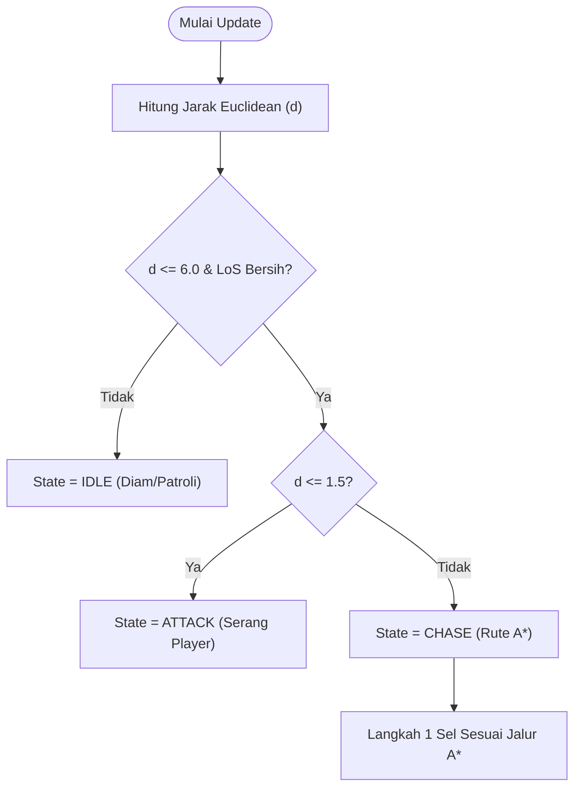

# Algoritma AI Enemy Dungeon Pathfinding

---

## 1. Identifikasi Algoritma

| Komponen AI | Algoritma / Metode | Fungsi Ringkas | Formula |
| :--- | :--- | :--- | :--- |
| **Pengontrol Status** | **Finite State Machine (FSM)** | Mengatur status musuh (`IDLE`, `CHASE`, `ATTACK`). | Transisi kondisi |
| **Deteksi Jarak** | **Euclidean Distance** | Menghitung jarak lurus ke Player. | $d = \sqrt{\Delta x^2 + \Delta y^2}$ |
| **Line of Sight** | **Bresenham's Raycasting** | Mengecek pandangan terhalang tembok atau tidak. | Grid Line Test |
| **Pathfinding** | **A* (A-Star)** | Mencari rute terpendek mengitari tembok. | $f(n) = g(n) + h(n)$ |
| **Heuristik A*** | **Manhattan Distance** | Estimasi sisa langkah grid. | $h(n) = \|\Delta x\| + \|\Delta y\|$ |

---

## 2. Cara Kerja Ringkas

1. **`IDLE`**: Musuh diam/patroli jika Player di luar radius deteksi ($d > 6.0$) atau pandangan terhalang tembok.
2. **`CHASE`**: Musuh mengejar Player menggunakan rute **A*** saat Player terlihat ($d \le 6.0$ & *Line of Sight* bersih).
3. **`ATTACK`**: Musuh menyerang saat jarak ke Player sudah sangat dekat ($d \le 1.5$).

---

## 3. Flowchart



---

## 4. Code Snippet Ringkas

```python
import math, heapq

# 1. Jarak Euclidean & Manhattan Heuristic
def distance(p1, p2):
    return math.sqrt((p1[0]-p2[0])**2 + (p1[1]-p2[1])**2)

def heuristic(p1, p2):
    return abs(p1[0]-p2[0]) + abs(p1[1]-p2[1])

# 2. Line of Sight (Raycasting Bresenham)
def check_los(grid, start, end):
    x1, y1, x2, y2 = start[0], start[1], end[0], end[1]
    dx, dy = abs(x2 - x1), abs(y2 - y1)
    sx, sy = (1 if x1 < x2 else -1), (1 if y1 < y2 else -1)
    err = dx - dy
    cx, cy = x1, y1
    while True:
        if (cx, cy) != start and (cx, cy) != end and grid[cx][cy] == 1:
            return False  # Terhalang tembok
        if (cx, cy) == (x2, y2): break
        e2 = 2 * err
        if e2 > -dy: err -= dy; cx += sx
        if e2 < dx: err += dx; cy += sy
    return True

# 3. Pathfinding A* (A-Star)
def a_star(grid, start, goal):
    open_set = [(0, start)]
    came_from = {}
    g = {start: 0}
    while open_set:
        _, curr = heapq.heappop(open_set)
        if curr == goal:
            path = []
            while curr in came_from:
                path.append(curr)
                curr = came_from[curr]
            return path[::-1]
        for dx, dy in [(-1,0), (1,0), (0,-1), (0,1)]:
            nx, ny = curr[0] + dx, curr[1] + dy
            if 0 <= nx < len(grid) and 0 <= ny < len(grid[0]) and grid[nx][ny] == 0:
                tg = g[curr] + 1
                if (nx, ny) not in g or tg < g[(nx, ny)]:
                    g[(nx, ny)] = tg
                    heapq.heappush(open_set, (tg + heuristic((nx, ny), goal), (nx, ny)))
                    came_from[(nx, ny)] = curr
    return []

# 4. FSM Update
def update_enemy(enemy_pos, player_pos, grid):
    d = distance(enemy_pos, player_pos)
    has_los = check_los(grid, enemy_pos, player_pos)
    
    if d <= 6.0 and has_los:
        if d <= 1.5:
            return "ATTACK", enemy_pos
        else:
            path = a_star(grid, enemy_pos, player_pos)
            next_pos = path[0] if path else enemy_pos
            return "CHASE", next_pos
    return "IDLE", enemy_pos
```
